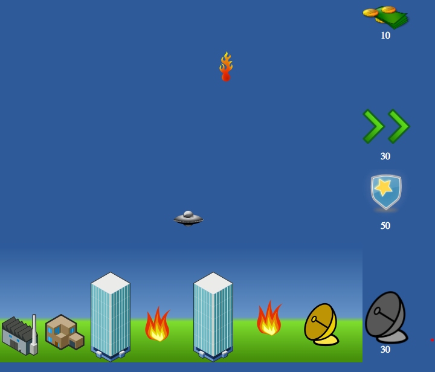

# Town Defender
This is a simple arcade game I developed in less then 24 hours for a contest in 2010. 

Goal is to protect city from asteroids using your flying saucer. Use keyboard arrow keys to move. Asteroids are destroying buildings, when you catch them you earn money. Money can be spent to ship upgrades. Every next asteroid moves faster and it is harder to catch.

Live version available here: https://alexuslab.com/town-defender/

